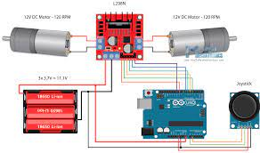
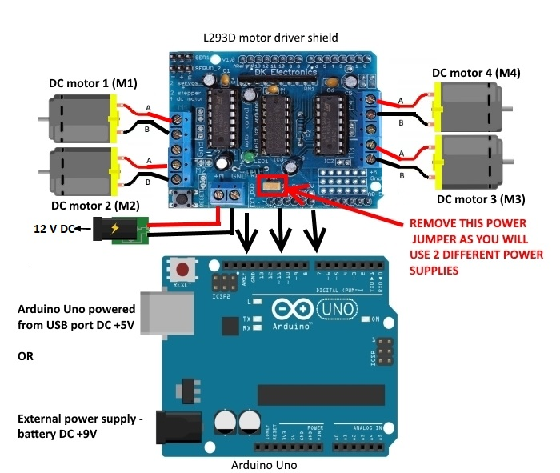
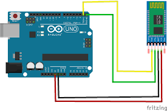
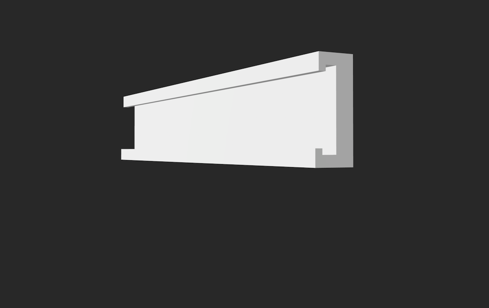
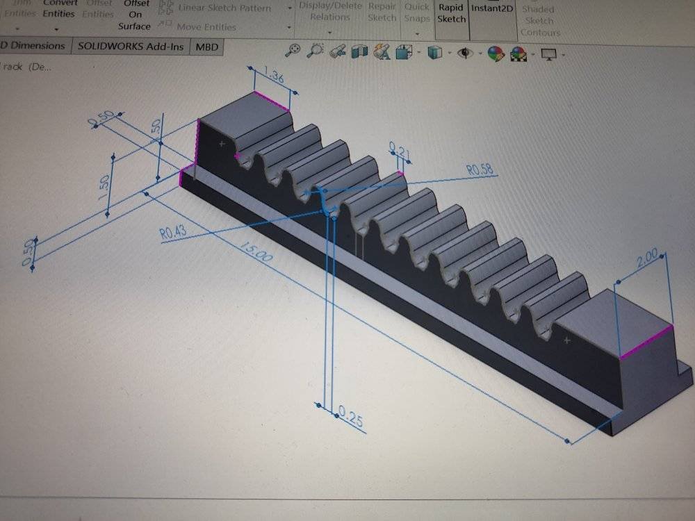
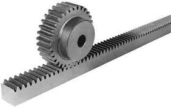
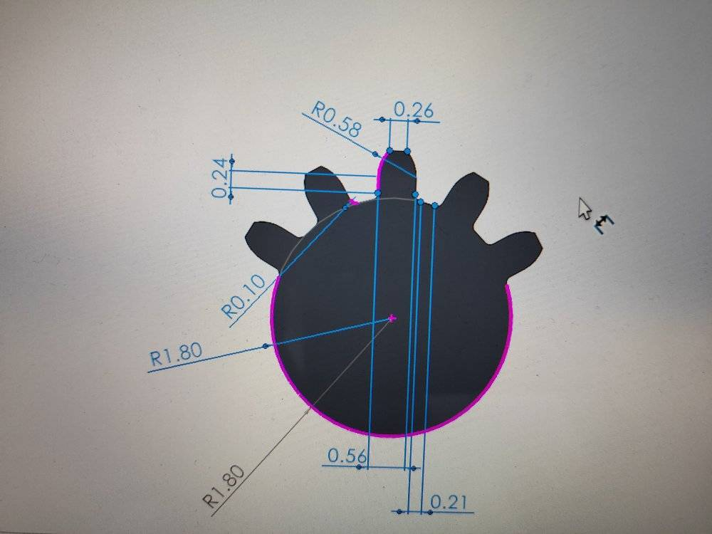
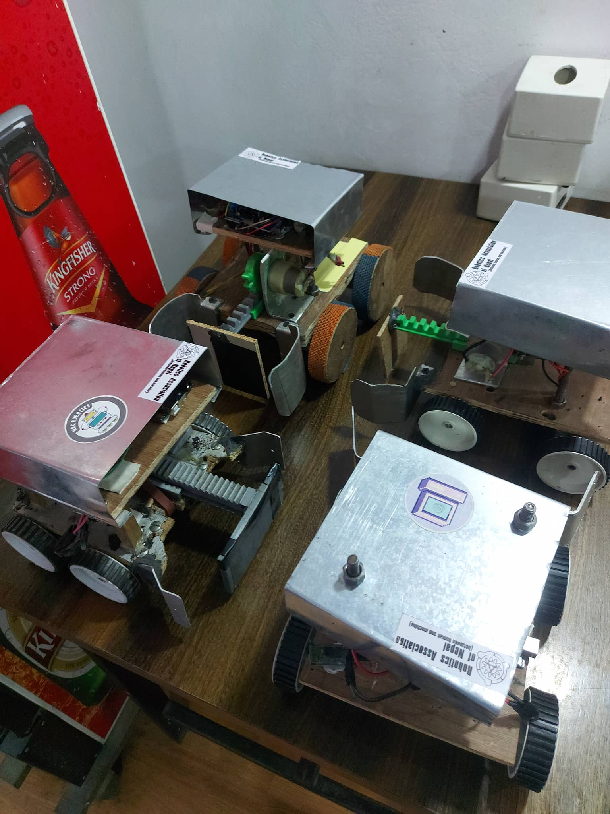

# Soccer Robot

> Documented by: Aayush Shrestha
>
> Public source: https://github.com/aayushshrestha783/RobotSoccer

### Introduction :
- A specialized mobile robot that is used to play variants of soccer is termed as `Soccer Robot`.
- 4 Soccer robot  was build for CNIYEF Nepal Start-Up Fest

### Components :
- Chasis
- Clamp
- Stud
- Motor
- Wheel
- Arduino
- Arduino Shield
- Motor Driver
- Motor Driver Shield
- Bluetooth Module
- Jumper Wires
- Battery
- Screws
- `For Kicking Mechanism` :
    - Rack and Pinning Technique(Parts) :
        - Rack
        - Rack slider
        - Pin Gear
        - Catapult Rubber

### Process :
- Firstly the Chassis was made using ply of size 20*17cm.
- Clamp was made using aluminium sheet to hold the motor(for 2 soccer bot 300 rpm motor were used and 200 rpm motor was used for the rest).
- In first layer :
    - Motor was fixed in the chasis using clamp.
    - Battery was also placed maintaining CG.
    - Wheel was fixed in motor.
    - `For Kicking Mechanism`
        - Solid Works was used for designing the parts(rack, rack slider and pin gear) and printed using 3d printer.
        - 200 rom motor was used to rotate pin gear.
    - To hold next layer, we drilled in the chassis according to the stud size.
- In second layer :
    - Arduino, Arduino Shield, Motor Driver, Motor Driver Shield & Bluetooth module was connected using the Jumper wires and some of them were soldered(Either motor driver or ardiuno shield was used).
    - 4 soccer bots were made in which in first bot monster motor shield was used with extra motor driver.
    - In 2 bots arduino shield was used with arduino with extra motor driver.(Arduino shield and monster motor driver shield was used to protect from back emf and heating issues).
    - In last bot two motor driver was used.
    - A tin plate was used to protect the electronic components from any damages.

### Problems faced while making the robot:
- Lack of planning and research.
- Frequent Change in design due to change in components.
- Late completion of robot.
- Lack of practice.

### Problems faced in competitions:
- Our robot speed was slow compared with others.
- Wheel slipped in the areana and a couldn't take a proper turns.

### Conclusion:
- Make proper research about rules and guidelines for the competition.
- Complete the robot 3-4 days ahead and practice.
- Kicking mechanism is not necessary ( speed and control of robot is very crucial).
- Take ideas but never depend on anyone.
- Never wait for some components and stop the work.
- And lastly if lost, don't be hopeless know your worth think about the things you learned during the process and be happy you got this opportunity.🙂

# Images :
### Circuits
<h2>Connection of motor driver, arduino, motor</h2>

<h2>Connection of Arduino shield, Motors</h2>

<h2>Connection of Bluetooth module and arduino</h2>

<h2>Rack Slider</h2>

<h2>Rack</h2>

<h2>Rack and Pin gear system</h2>

<h2>Pin gear</h2>

<h2>All Bots</h2>

